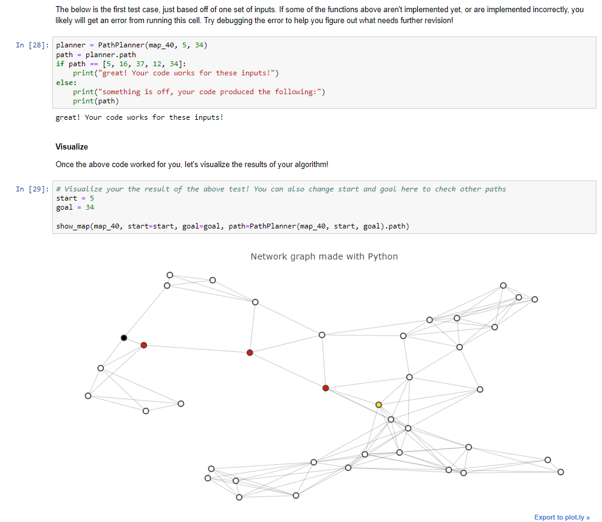

## Udacity Intro to Self-Driving Car

  
  

  

  
  

  
  ## Section: Bayesian Thinking 
  * Joy Ride - Control Simulator with Python
  

  
  

  
  
 Next:
 
 
  * Programming Probability in Python
  
  *  Bayes' Rule
  
  *  Programming Baye's Rule and World Representation

  *  Probability Distributions

  *  Programming Probability distributions

  

  
  

  
  
  * 2D Histogram  filter
  
  

  
  

  
  ## Section: Working With Matrices
  
  * Introduction to Kalman Filter

  * Object-Oriented Programming

  * Matrices and Transformation of State

  * Implement Matrix Class

  

  
  

  
  
  
  

  
  

  
  
  ## Section: C++ / Python vs. C++ speed
  
  * C++ Vectors

  * C++ OOP

  * Translate Python to C++

  ## Section: Navigating Data Structures
    
  * Python Basic Data Structures

  * Search Problem / A-Star Search algorithm

  * Implement Route Planner

    
   

  
  

  
  

  
  

  
  
  
  * Testing my Code 

  

  
  

  
  ## Section: Vehicle Motion and Control
  
  
  * Odometers, Speedometers and Derivatives

  * Accelerometers, Rate Gyros and Integrals

  * Two Dimensional Robot Motion and Trigonometry

  * Reconstructing Trajectories from Sensor Data

  

  
  

  
  
  
  
  

  
  

  
 
 
  

  
  

 
  
